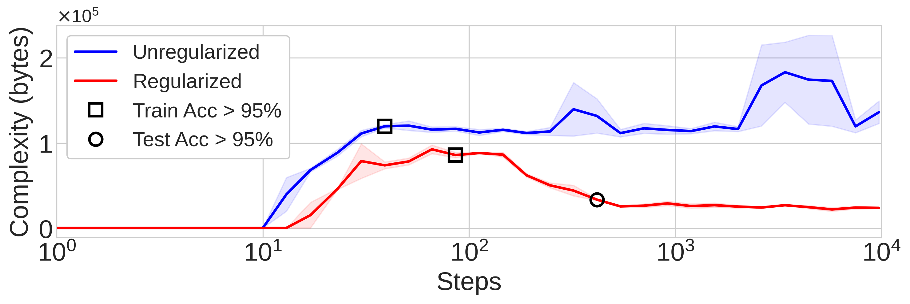
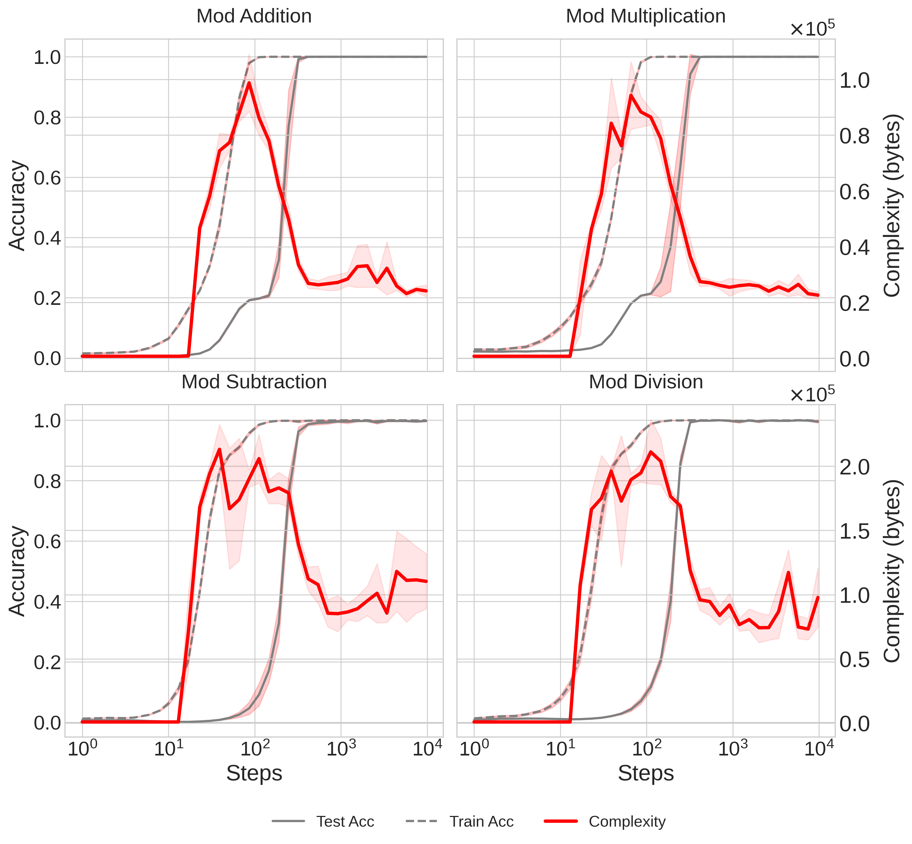

 Branton DeMoss, Silvia Sapora, Jakob Foerster, Nick Hawes, Ingmar Posner   <a href="https://arxiv.org/">ar$\chi$iv</a>

 

*In grokking experiments, the unregularized network's complexity rises at it memorizes the training data, and remains high, never generalizing. The regularized network's complexity similarly rises, but as it groks and generalization occurs, the complexity falls.*

When can we say a neural network “understands” the task it has learned? 
If one network “understands” its training data better than another, shouldn’t it generalize better? 
To answer these questions, we study networks which suddenly transition from memorization to perfect generalization: the “grokking” phenomenon first reported in [Power et al](https://arxiv.org/abs/2201.02177). 
We introduce a new way to measure the complexity of neural networks based on *lossy compression* and Kolmogorov complexity, and use this framework to track the complexity dynamics of neural networks which grok. 
We find a characteristic **rise and fall of complexity** in the networks, which corresponds to memorization followed by generalization. 

## Grokking

When neural networks are ideally trained, train and test loss decrease together. 
The grokking phenomenon occurs when there is a large gap between training loss going to zero, and test loss going to zero. 
For example, if we train a small transformer to do modular arithmetic, we see that after a few hundred training steps, the model has fit the training data perfectly:

However, it does not generalize at all until around $10^5$ training steps. 
This network is trained with a small amount of weight decay, but if we don’t regularize the network at all, it never generalizes, and stays in the “memorization” phase indefinitely. 
The grokking phenomenon provides a crisp example of a generalization phase transitions in neural networks, hence we study these tasks to understand the nature of generalization. 
We find that there is a characteristic **rise and fall of complexity** in the networks as they undergo the transition from memorization to generalization.

## Complexity Proxies
Neural network complexity is often identified with model size, i.e. parameter count, or with the total norm of the weights. 
Neither of these measures are quite correct, as we’ll explain in more detail later, but to see why these measures cannot be correct:

1. In the case of the norm of the weights—is a network whose weights are all “10” more complex than a network whose weights are all “1”? There is a symmetry associated to re-scaling the weight norms. Intuitively, both of these networks are very simple, but if we only look at the norm, we’re led to think networks with larger parameters are more complex. 
2. If we think of the parameter count as the network’s complexity, then *network complexity can’t change throughout training*, which is clearly incorrect. The networks start with random performance, and end up being able to predict their data well, so something is certainly changing throughout training.

While these examples might feel contrived, it's important to understand the subtle ways these proxy measures go awry: the nature of complexity is subtle, and it requires care to understand properly. 
We fix these issues by using a proper, universal measure of complexity, the Kolmogorov Complexity, and show how to approximate this measure appropriately for neural networks. We find an interesting dynamical signature of changing complexity in the networks as they transition from memorization to generalization.

## MDL and Generalization
Occam’s Razor says that between equally good explanations, the simplest one generalizes best. 
This intuitive principle can be made sharp by unifying ideas from statistical generalization bounds and the Minimum Description Length (MDL) principle: 
The MDL says that the best model $M$ for some dataset $D$ is the one which minimizes the *sum* of the model’s complexity $C(M)$ and the entropy of the data under the model $H(D|M)$:
\begin{equation}
	\min H(D|M) + C(M)
\end{equation}
The better a model explains a dataset, the more it reduces the apparent entropy of that dataset, $H(D|M)$. 
However, this comes at the cost of specifying the model. 
You always have to specify a model to reduce entropy, which takes information. 
The model is only good if it reduces entropy more than it requires information to specify.
We can always reduce the entropy to zero by making the model be e.g. a lookup table of all the training data—a rather trivial “model”. 
In that case, we’ve just exchanged all the data entropy for model complexity, with no net compression savings. 
Solutions like these are called “memorizing” solutions, and we do not expect them to perform well on unseen data. 
A good model compresses the data by reducing its entropy while being itself as simple as possible, hence minimizing the sum of these two terms. 

Across a number of fields of statistical machine learning, there are generalization bounds which relate the expected test error to the measured train error and the model’s complexity:
\begin{equation}
	\text{test error} \leq \text{train error} + \text{model complexity}
\end{equation}
Notice that if the error terms are identified as entropies, as is typically the case, models which minimize the MDL principle also minimize these generalization bounds! 
Hence, models which best compress the data are the ones which are expected to generalize best.

## Complexity
We’ve shown how low complexity models are preferred when compressing data, and models which achieve both low complexity and low entropy on their training data generalize best. 
But what is complexity? 
Intuitively, a complexity measure should have units of information: it appears summed with entropy in the previous equations.
The **Kolmogorov Complexity** $K$ of a string s is defined to be the length of the shortest program which prints s:
\begin{equation}
	K(s) = \min \{ \texttt{len}(p) | \texttt{exec}(p) = s \}
\end{equation}
So strings like “11111111…” are simple becauser they have a short description (program) which produces them: “print ‘1’ N times’.
Strings like “100101011010…” are complex, because they lack regularity and so cannot be described compactly. 
We say a string is *algorithmically random* if it has no description shorter than itself, i.e. $K(s) = \texttt{len}(s)$. 

Notice that this conception of complexity is intimately related to compression: simple strings are those which are highly compressible, whereas maximally complex (algorithmically random) strings are not at all compressible. 
In fact, while we cannot compute the Kolmogorov Complexity, we can upper-bound it by compression: if we compress our string, then the compressed data with the decompressor are a program which prints the original string. 
So the tighter we can compress the data, the tighter a bound on its complexity we can produce. 
We cannot know a string’s true complexity, even in principle, but we can get tighter and tighter upper-bounds on how complex it is, by compressing the string more and more.

## Noise
A further problem with estimating complexity by compression is the presence of noise in the networks. 
Networks are randomly initialized and trained with a stochastic process, so they contain a lot of random information which prevents useful compression, and interferes with complexity estimation. 
To fix this, we take inspiration from rate—distortion theory, which formalizes *lossy compression*. 
Proper lossy compression requires the notion of a *distortion function*, which measures the degree and kind of distortion we are willing to accept when lossily compressing. 
For image compression schemes like JPEG, the distortion function captures human visual perceptive similarity. 
JPEG exploits the fact that humans are insensitive to high-frequency details in images, by taking a cosine-transform of the pixel plane and then removing the high-frequency information, gaining large savings in the compressed filesize for minimal distortion according to a model of human perception. 
To extend this idea to neural networks, we set the distortion function to be equal to the *loss function*. 
Our compression scheme works as follows: 

1. Coarse-grain the network weights $\theta$ to get $\tilde{\theta}$
2. Check that $\left | \mathcal{L}(\theta, D_{\text{train}}) - \mathcal{L}(\tilde{\theta}, D_{\text{train}}) \right | < \epsilon$
3. If the distortion bound is not satisfied, adjust coarse-graining and repeat. If distortion bound is satisfied, then return the complexity upper bound $\texttt{gzip}(\tilde{\theta})$

We always search for the coarsest set of weights $\tilde{\theta}$ that satisfy the distortion bound, since we want the tightest possible upper-bound on the complexity. To coarse-grain the weights, we use tricks like quantization and low-rank approximation, which we discuss more in the paper.

## Results
Tracking these complexity estimates throughout training on the grokking tasks, we notice something remarkable: the complexity first rises as the networks memorize their training data, and then falls as the networks generalize, and some simple pattern/explanantion emerges in the network.

*Network complexity and train and test accuracy vs training steps. As train accuracy goes to $100\%$, the complexity rises. As generalization occurs and test accuracy approaches $100\%$, the complexity falls as the networks learn a simple explanation of the data.*

Complexity is a dynamical quantity that is constantly changing as networks learn different representations. We know from statistical generalization bounds that the simplest representations must generalize best. We demonstrate that when sudden generalization occurs during grokking, it corresponds to a rapid fall in the complexity of the network. Please see the paper for further details.
