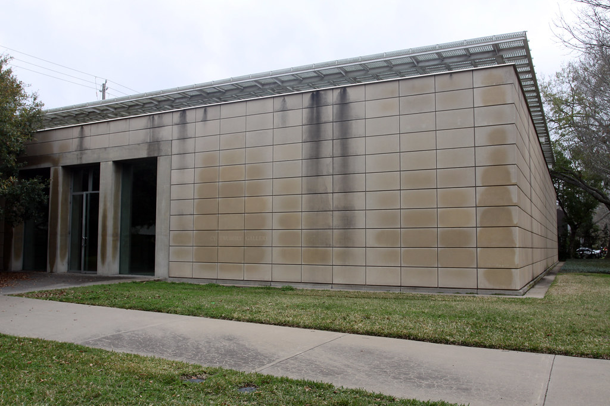

# Say Goodbye, Catullus, to the Shores of Asia Minor

I do not know Cy Twombly, his context, the history of art around him. This is not about Cy Twombly.

Say Goodbye, Catullus, to the Shores of Asia Minor is a large painting in the Menil Collection in Houston, Texas. The grounds host a few buildings dedicated to art, and a very nice swing suspended from a tree over some grass.

The first time I visited Houston I saw the painting. It is a large painting, with many colors, various shapes, and contains words which are near-indecipherable.

This is not about the painting.

The painting flows from left to right, gradually increasing in color saturation and detail, starting as mere monochrome lines, ending in a bursts of colors and memory.

I do not understand the painting. This is about October and everything it has forgotten about Summer.

I walked past the stooping old tree planted in the lawn by the Gallery entrance, past the receptionist's desk. To the left, a large room.

Inside the room a large painting. Lit mostly by light cast from large, slanting windows overhead. The sunlight not directly penetrating the painting, merely there.

I saw the painting. Large. Flowing from left to right. I sat down on the bench at the furthest point from the Object to view it.

For an hour I sat and viewed the painting. I did not get any closer than the furthest point. I did not look at any other paintings in the building. This time it was about a girl in winter, and memories of creeks flowing in Summer. Of stacking rocks which would fall down, clack clack clack.

This time it was about the rise of awareness from not awareness. Of forms from Not Forms. This time it was about the warm things which did not pan out, like the girl in the winter in October.

I didn't want the painting to be about the girl in the winter in October, who did not pan out, but, nevertheless, the painting was about the girl in the Winter in October, who did not pan out.

Some months later, in November, I returned to Houston, and saw the Painting again. This time I got very close to the painting. I smelled the painting, but I still had no answer for the Girl in October who Did Not Pan Out.

I looked very closely at the letters which made sort-of-words, but the words did not explain it either.

Obviously, the painting is not about the girl who did not pan out in October. The painting was made by a man I have never met, could not have ever met, in a room I have never seen.

But I am sure the painting contains the Girl Who Did Not Pan Out in October. Next time I visit, I think I will look at the painting again, and wonder about the girl in October, who did not pan out, in the Winter.