% Love Letter to KataGo or:   Go AI past, present, and future

*KataGo (B) vs Leela Zero (W)[^kata1]*

>In order to programme a computer to play a reasonable game of Go - rather than merely a legal game - it is necessary to formalise the principles of good strategy, or to design a learning programme. The principles are more qualitative and mysterious than in chess, and depend more on judgment. So I think it will be even more difficult to programme a computer to play a reasonable game of Go than of chess.  - I J Good, 1965[^quote1]

There's something magical about the game of Go. For thousands of years, it has captured the imagination of those who want to learn *what it is to learn*, to think about what thinking means.

With the recent advent of strong, open source Go AI that can beat top professionals, it's worth tracing the history of the game, why it remained so difficult to beat humans for so long, and what the future of Go may hold.

## Classical AI
>Looked at in one way, everyone knows what intelligence is; looked at in another way, no one does.  Robert Sternberg, 2000

How we define AI has changed over time, older naive definitions were mostly concerned with capability on specific tasks, defining AI as 

>The science of making machines capable of performing tasks that would require intelligence if done by humans. Marvin Minsky, 1968

Definitions like these are inherently unstable, because as we build these "intelligent" computer systems and become normalized to their (at first) astonishing capabilities, we stop thinking of their task performance as demonstrating any kind of intelligence. Defining intelligence in relation to skill in particular tasks, no matter how difficult they may be, leaves AI in a sort of [God of the gaps](https://en.wikipedia.org/wiki/God_of_the_gaps)&nbsp;situation.

Some have proposed that intelligence is the ability to perform many tasks well, or the ability to solve tasks in a diverse range of environments[^8]. Others claim that intelligence is the ability to acquire new skills through learning[^9]. More recently there have been proposals[^10] that intelligence is a measure of skill acquisition *efficiency*. Given two agents with the same knowledge and fixed training time on a novel task, the more intelligent agent is the one that ends up with better skills.

The most popular AI system of the last century was Deep Blue, a chess playing system designed by researchers at IBM. The system consisted of a hand-crafted board evaluation function, a tree search to maximise expected board state value given an adversarial opponent, and custom hardware designed to accelerate those operations, achieving speeds of around 100 million position evaluations per second.

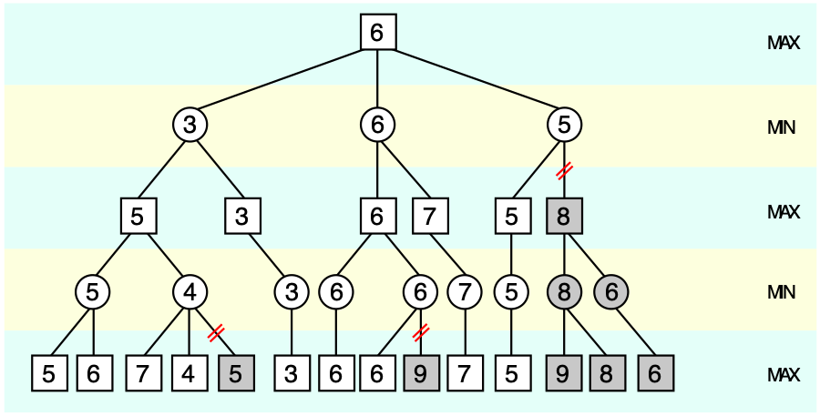
*Alpha-beta pruning tree[^12]*

Value functions measure the "goodness" of states (read: how likely they are to lead to victory). They take the state of the baord as input, and output an estimate of the value of the current state. Creating meaningful evaluation functions is no small task - indeed, the Deep Blue evaluation function consisted of 8000 hand coded heuristics[^11]! Programmers got together with chess experts to assign value to various board states - rooks on the back rank, passed pawns, king safety, etc... All of these individual heuristics were carefully weighted and combined to give an approximate overall singular board value, which was then optimized for via a tree search through many possible future board states.

With a well-tuned value function and powerful tree search to read ahead and find a value-maximising trajectory, Deep Blue managed a win over Garry Kasparov, the world chess champion, in 1997[^6].

Deep Blue is an example of an "expert system" - one which has human expert knowledge encoded into it. It did not learn from its play, or generate novel heuristics or understanding - it maximised board state value according to the human-defined value function.

## Complexity
Like chess, Go is a deterministic game of perfect information. There is no stochasticity, no hidden state. 

Unlike chess in which there are on average around 35 legal moves to consider playing each turn, there are on average around 250 legal moves to consider in Go.

In tic-tac-toe, we can search the entire game tree, and easily find the optimal response for any position. xkcd nicely summarized this in an image:

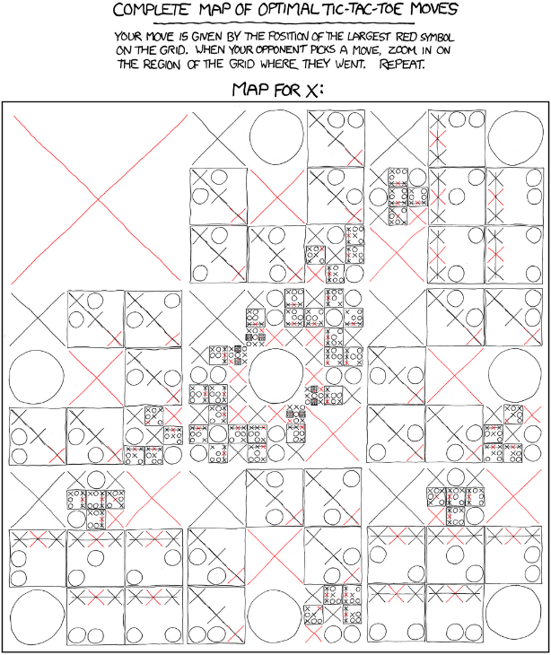
*Perfect $\times$ strategy[^1]*

Although it is in principle possible to create such a tree for Go since it is a finite game, the state space of Go is very large: the number of legal positions[^2] in Go is approximately $2.1 \times 10^{170}$.

Since a game is a trajectory through legal board states (with some transition constraints), the number of possible games of Go is considerably larger. The number of unique games of Go has been bounded between $(10^{10^{108}},10^{10^{171}})$ [^3] [^4].

## Intuition & Reading
Because the state space of Go is too large to be enumerated and searched through, players must learn to focus only on promising moves when considering possible game state trajectories (variations), in other words players must develop an *intuitive* sense of what moves might be good, and avoid wasting time on dubious possibilities. Empirically, defining such a value function turns out to be much more difficult for Go than for chess - efforts mirroring chess in this direction did not produce good results.

While intuition guides move selection, reading out variations strengthens intuition using a form of self-argument: because Go is a [zero sum game](https://en.wikipedia.org/wiki/Zero-sum_game), move choice is necessarily conditioned on an adversarial opponent. Player's goals are perfectly anti-aligned, so an optimal strategy can be constructed by considering maximising future state-value *given a minimizing opponent* (this logic is nicely encoded in the [minimax algorithm](https://en.wikipedia.org/wiki/Minimax)).

In light of difficulties creating a meaningful evaluation for Go, an approach that saw some success was a modified tree search called Monte Carlo Tree Search (MCTS)[^13]. MCTS randomly samples legal moves from the current position, and rolls out the game tree all the way to the end, evolving each position using a random move. The value of the initial move is related to the proportion of rollout trajectories that result in a won terminal state. Somewhat surprisingly, Go bots using MCTS were able to reach advanced amateur level (low-mid dan) play!

There is something deeply interesting in the fact that defining state values by evaluating *random* rollouts to the end actually provides a meaningful approximation of "true value". It seems tautological when spelled out, but truly "good" moves really do have a greater proportion of trajectories leading to victory, and **random sampling** is enough to approximate their value.

## Neural Networks
If the heuristics of board evaluation and move selection are so hard to program, so hard to even specify, how can humans play Go so well? Some experts can read many variations out very quickly, but nothing like the hundreds of millions per second of Deep Blue. 

Human move selection intuition is *excellent*. At a glance, a very small number of moves stand out as worth considering. From the experience of many games of Go, we seem to be able to learn a sharp sense of which moves work, and which moves don't. We also have the advantage of being able to read Go theory, which is the distilled experience of many others over millennia (incorporating symbolic knowledge into learning systems is an unsolved problem).

How can AI agents be given this excellent intuition? Convolutional neural networks!

*Convolutional kernel (dark blue) applied to input (blue) to produce output (cyan)[^14]*

Briefly, convolutional neural networks are an example of a [neural network](https://en.wikipedia.org/wiki/Artificial_neural_network) that use *local connections* which are particularly adept at learning about and processing spatially-correlated features in images. The GIF above shows a learned convolutional filter sliding around an image, producing a lower-dimension representation. Typical networks contain millions of such learned parameters, and can perform a [wide](https://www.youtube.com/watch?v=b62iDkLgGSI) [variety](https://www.youtube.com/watch?v=D4C1dB9UheQ) [of](https://www.youtube.com/watch?v=qWl9idsCuLQ) [tasks](https://www.youtube.com/watch?v=HgDdaMy8KNE) in image processing.

As convolutional neural networks started to show promise in image recognition tasks[^15], and since neural networks can approximate any function[^16], people began thinking about using them to estimate the value function, treating the board state encoding as an "image" input to the CNN. The idea is straightforward: given some board state and final game result pair, $(s,r)$ train your CNN to predict $r$ from $s$ - the prediction of $r$ (constrained between $[0,1]$ to be interpreted as a *probability* of winning) represents our state value. What's more, given the same state $s$, we can estimate the next move (called the *policy*).

And so people began downloading hundreds of thousands of games of Go played online by strong amateurs, and trained CNNs to predict moves and win-rates. Agents playing from raw policy alone could outperform some of the weaker Go bots, but still struggled against strong MCTS bots.

By combining CNN-based policy and value estimation *with MCTS* (i.e. instead of randomly sampling moves, we *weight the MCTS sampling with the policy* from the CNN, and instead of rolling out to a terminal state, we estimate the value of the current state from the value network), these prototype CNN bots started to outperform all others, but professional humans were still out of reach.

## AlphaGo
Although MCTS improved the play of CNN-based bots, the neural networks were trained solely on human games and had no means of improving beyond human knowledge. They could only weakly imitate human intuition.

To solve this problem, AlphaGo uses self-play and reinforcement learning to improve the policy and value estimations.

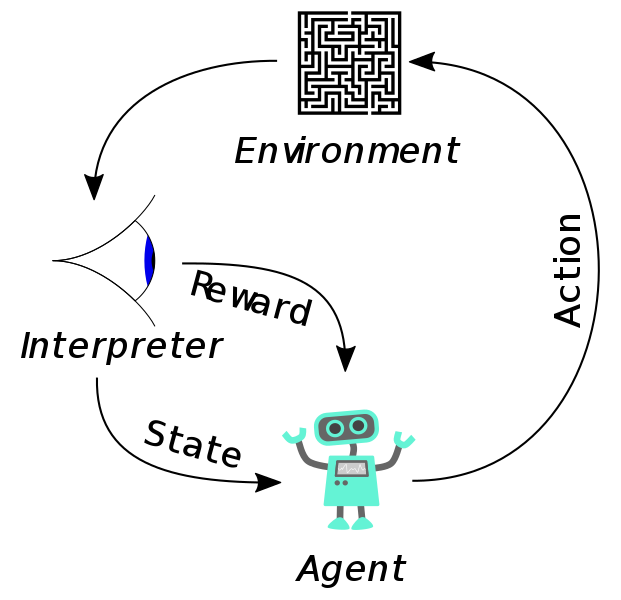

Broadly, reinforcement learning agents take actions in an environment, receive rewards and observations from their environment, and learn to adjust their actions to maximise future rewards. In this case, the "environment" is a simulated game of Go, and the reward is the final result of the game (i.e. the rewards are sparse, and only received after many actions are made).

Because the MCTS in AlphaGo optimizes for maximal value (which measures probability of winning), by producing and training on games of self-play, the network can be further trained to produce better value predictions, and importantly, the policy can be trained *on the MCTS search values*, that is, we can train the policy CNN on the final policy distribution found by MCTS during self-play. Using self-play reinforcement learning to continually train the policy and value networks, AlphaGo was able to surpass human performance, defeating world-champion Lee Sedol 4-1.

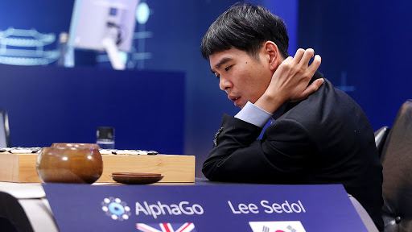
*DeepMind: [AlphaGo vs Lee Sedol](https://deepmind.com/alphago-korea)*

The ways in which AlphaGo diverges from human play are as shocking as the ways in which it does not. There is no particular reason to assume AlphaGo should play anything at all like humans - it is only optimized to win, and yet AlphaGo still begins by placing stones in the corners like humans, still plays "normal" approach and asking moves. AlphaGo's convergence with humans on many aspects of Go is reassuring: we are not totally misunderstanding the game. An external intelligence broadly agrees with the moves we make - something about our play is "correct", our ideas about the game aren't totally off-track. 

And yet, there are divergences. AlphaGo plays moves and expresses ideas that humans have never seen, that just look "wrong" from our viewpoint. Much has been said about move 37 in the second game against Lee Sedol: A fifth line shoulder hit that feels wrong - not one of the moves a human would seriously consider, even have on their radar.

But these moves work. AlphaGo wins. It discovered ideas about the game that we do not understand.

## AlphaZero
Although AlphaGo succeeded in beating world champion Lee Sedol, the team at DeepMind wanted to push reinforcement learning further. AlphaGo's policy and value networks had been initialized on many thousands of human games before any self-play reinforcement learning was performed.

In addition to the raw board state, AlphaGo's inputs included the following for every evaluation:

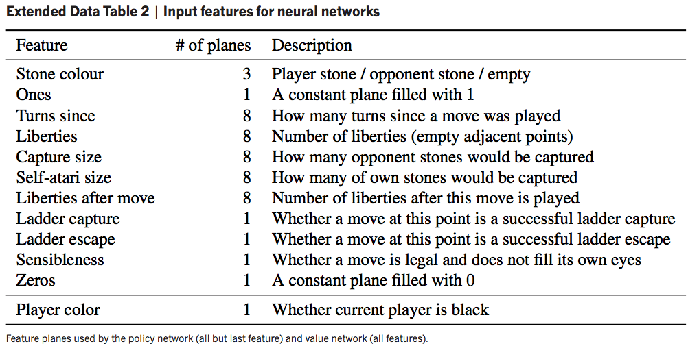
*Feature planes of AlphaGo[^17]*

In a sense, there was still Go-specific knowledge that AlphaGo was "programmed with", and the team wanted to see if a bot with zero game-specific knowledge could perform similarly.

In 2017 the team published the AlphaGo Zero paper[^18], with three primary improvements:

1. The networks are trained solely from self-play reinforcement learning, starting from random play with no pre-training on human data.
2. Only the black and white stone positions are used as input features to the networks.
3. The policy and value networks are combined into a single network with shared backbone, with shallow policy and value heads on top.

With these changes, AlphaGo Zero far surpassed AlphaGo's performance, gaining massive increases in training efficiency from the combined policy and value net, and from using a ResNet-like architecture[^19] instead of a fully convolutional network.

To measure relative playing strength of different agents, a commonly-used metric is [Elo rating](https://en.wikipedia.org/wiki/Elo_rating_system). While the full details of Elo rating (and how it corresponds to handicap stones) are beyond the scope of this article, briefly, Elo rating encodes relative probability of winning. Using the standard scales, for example, a 100 point rating difference encodes an expectation that the higher rated player has a 64% chance of beating their opponent; if the difference is 200, then the expectation is 76%.

There is a wonderful plot of Elo ratings of various bots from the AlphaGo Zero paper:

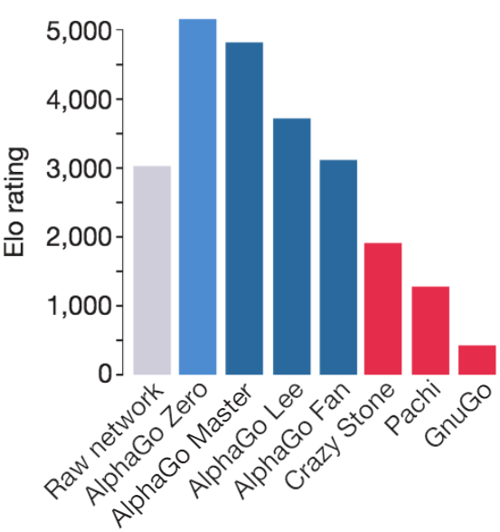
*Elo comparison of various computer Go programs. Lee Sedol would be around 3500 on this scale at the time of his match against AlphaGo.*

Note that the raw network (just playing top move recommended by policy net) strength is around ~3000, while the full AlphaZero bot (using the policy network + MCTS + value network) achieves a rating > 5000. This gives us an idea of how much stronger the tree search and value estimation makes the raw network move intuition.

In the context of our earlier definition of intelligence as a measure of learning efficiency, it would have been excellent to see how the Elo strength as a function of self-play games changed from AlphaGo to AlphaGo Zero.

Finally the DeepMind team extended their AlphaGo Zero method to chess and shogi, removing all Go-specific aspects of the program (e.g. not generating additional training samples from the [board's symmetry](https://en.wikipedia.org/wiki/Dihedral_group)), and published again, calling it AlphaZero.

## Zero Explosion
AlphaGo shook both the Go world and AI research community, but DeepMind largely left their work behind and moved on to other topics. With only the research papers to guide them, many started to re-implement AlphaZero.

As early as the first published paper on AlphaGo, many private companies, especially in China, S. Korea and Japan (where commercial Go products are viable) began to recreate AlphaGo/Zero. While these bots were helpful to those who could afford access, it wasn't until open source bots became wide-spread that the Go community could fully take advantage of their benefits.

The most well-known open source bot is [Leela Zero](https://zero.sjeng.org/home), a faithful re implementation of AlphaZero, which uses crowdsourced GPU compute to produce games of self-play and train the network. Leela Zero has been training since late 2017, and has produced about 20 million games of self-play as of May 2020.

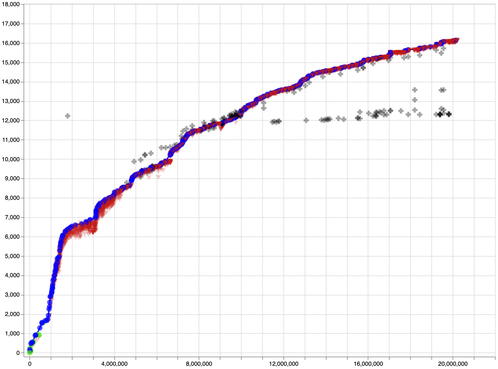
*Leela Zero Elo rating vs. number of games of self-play[^20] Note: Self-play Elo is inflated and does not correspond to the previously shown Elo graph.*

As Leela Zero and other bots became available to the public for review and play, Go experienced a cultural shift unlike any that had come before. Suddenly everyone had access to superhuman playing advice, and could get opinions on variations in study from one of the strongest players of all time. While AlphaZero was a breakthrough for the AI community, Leela and the open source bots like it were the real godsend for the Go community. Rather than just mimicking AlphaZero's moves, players could use these open source bots for in-depth review and study. World #1 Shin Jinseo reportedly brings an iPad with Leela Zero loaded up everywhere to review ideas and games. As AlphaZero and Leela Zero's influence on the game meta took hold, researchers at Facebook noticed that [players became stronger faster than anytime in history](https://ai.facebook.com/blog/open-sourcing-new-elf-opengo-bot-and-go-research/)!

While a great resource to the Go community, these Zero bots still had problems: they were expensive to train, taking months or years to achieve super-human performance with "normal" amounts of compute, they were [surprisingly bad](https://lifein19x19.com/viewtopic.php?f=18&t=17298) [at ladders](https://github.com/leela-zero/leela-zero/issues/1482) (at first), inherited AlphaGo's tendency to make slack moves when ahead, couldn't play with variable komi, and played erratically in handicap games.

In a 2019 World AI Cup, Leela failed to podium, losing $3^{rd}$ place to HanDol, a Korean commercial bot which would later play Lee Sedol for his final professional game. Disappointingly, the commercial bots destroyed the #1 open source bot Leela, likely due to vastly greater compute resources for training at their disposal. It is unclear what algorithmic differences, if any, the commercial bots have vs AlphaGo.

## Yann LeCun's Cake of Learning

"Godfather of AI", co-inventor of convolutional neural networks and Turing Award laureate Yann LeCun wants to tell you about his cake.

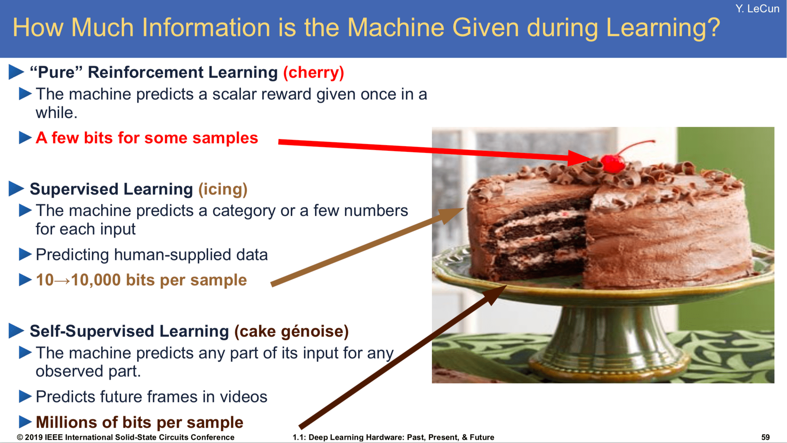
*Slide from [that one talk he's always giving](https://drive.google.com/drive/folders/0BxKBnD5y2M8NUXhZaXBCNXE4QlE)*

> If intelligence is a cake, the bulk of the cake is self-supervised learning, the icing on the cake is supervised learning, and the cherry on the cake is reinforcement learning  Yann LeCun

Yann's cake metaphor is meant to point out that the bulk of information contained in data is "unstructured". Reinforcement learning takes extremely noisy and low information density signal, e.g. a win-loss result from a game of self-play, and propagates that learning signal through many board states (e.g. training the value network to predict win rate from given board state). Because the signal-to-noise ratio there is so poor, reinforcement learning is **extremely** data-hungry.

Supervised learning is a little better: if we were to build a CNN to classify pictures of dogs, each training example would consist of an image and a human-made correct label that would only be backpropagated through a single image. The per-sample information density is much greater, and the label noise non-existent (unless the human has mislabeled the image!). Supervised learning generally requires far fewer examples than reinforcement learning to achieve good performance.

Finally there's what Yann calls "self-supervised" learning, in which "the system learns to predict part of its input from other parts of its input"[^22]. The idea is that the unstructured input data contains far more information than any supervised labels ever could, and so finding ways to cleverly predict parts of the input results in much better learning efficiency, and enables using a much larger set of unlabeled data.

A fun recent example of successful self-supervised learning is monocular depth estimation[^23].

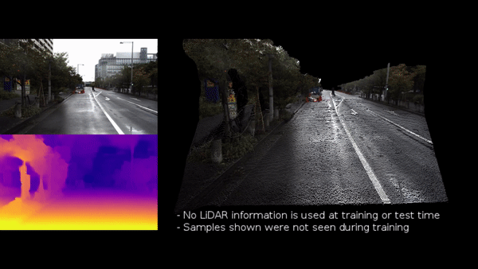
*Monocular depth estimation[^24]*

It would be very useful to estimate pixel-accurate depth maps from monocular camera images[citation needed]. Humans cannot accurately label per-pixel depth maps, and LiDAR data is expensive to gather, so can we somehow get a network to estimate depth using only raw images as training samples?

It turns out, yes! By exploiting frame-to-frame consistent scene geometry and the fact that sequential video frames contain many of the same objects, we can have a network guess a depth and camera pose, use some clever differentiable geometric transformations to *reconstruct* that scene from the guessed viewpoint of a subsequent video frame, and back propagate the consistency loss from the reconstructed and actual images to enforce scene-consistent depth and pose estimations. It turns out that the only way for the network to guess *consistent* depth and camera pose from frame-to-frame is to guess *correct* depth and pose. Using this method, networks can learn to predict accurate depth maps with only raw video input.

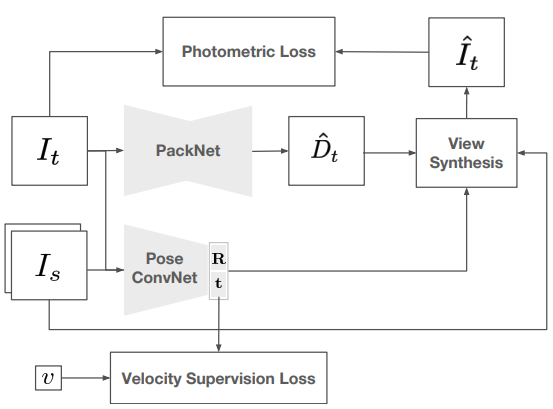
*Self-supervised monocular network diagram[^24]*

## KataGo
In late 2017 [lightvector](https://github.com/lightvector), a Go enthusiast and researcher at [Jane Street](https://blog.janestreet.com/author/dwu/), began work on an AlphaGo-style bot for personal experimentation. For those interested in the gritty details, I highly recommend people check out the original [repository](https://github.com/lightvector/GoNN) to follow along with his experimentation. The project evolved into a genuine research effort, and became [KataGo](https://github.com/lightvector/KataGo).

Like AlphaGo, KataGo uses a CNN to estimate win rate (value) and move choice (policy), but it forgoes some of the Zero methodology of disincluding Go-specific information, instead including relevant features as input to the network, such as ladder and liberty status, amongst others. In particular, for $b =$ board width, a $b \times b \times 18$ tensor of:

 # Channels | Feature
 :---: | :---
 1 | Location is on board
 2 | Location has {own,opponent} stone
 3 | Location has stone with {1,2,3} liberties
 1 | Moving here illegal due to ko/superko
 5 | The last 5 move locations, one-hot
 3 | Ladderable stones {0,1,2} turns ago
 1 | Moving here catches opponent in ladder
 2 | Pass-alive area for {self,opponent}

is passed as input to the CNN, along with an additional input vector of some global state properties including ko and komi details.

KataGo makes a number of seemingly small changes to the AlphaGo/Zero system that add up to huge efficiency gains in learning, and welcome usability improvements for the Go community.

Like AlphaGo, KataGo is trained from scratch via self-play reinforcement learning. There are four major improvements to learning efficiency:

1. Playout cap randomization:

   As noted in the KataGo paper, there is a "tension between policy and value training [...] the game outcome value target is highly data-limited, with only one noisy binary result per entire game", while the optimal policy training would use around 800 MCTS playouts per move. In other words, the value net would like more games to be played more quickly, but the policy net would like MCTS during self-play to go deeper to get better policy targets, so there is tension between these two goals due to limited compute. To solve this issue, during self-play KataGo occasionally performs a "full search" of 600 playouts for move selection, but mostly only uses 100 playouts to finish games more quickly. Only the "full search" moves are used to train the policy network, but because there are more game results, the value net has more training samples.

2. Forced playouts and policy target pruning:
   
   There is a classic trade-off in reinforcement learning between exploration and exploitation: should you use the knowledge you've learned to take optimal actions, or should you explore seemingly non-optimal moves to discover new behavior? KataGo attempts to solve this issue with *forced playouts*, where each child of the root that has received any playouts receives a minimum number of playouts. For more details, [read the paper](https://arxiv.org/pdf/1902.10565.pdf).

3. Global pooling:

   A relatively simple improvement is seen in KataGo by introducing occasional global pooling layers, so that the network can condition on board areas that may be out of reach of the perceptual radius of the convolutional layers. Experiments with KataGo showed that this greatly improves later stages of training, "as Go contains explicit nonlocal tactics ('ko'), this is not surprising".

4. Auxiliary policy targets:

   I think this is the most interesting change in KataGo, sharing some common ground with ideas like self-supervised learning: training additional policy targets. Typically, AlphaZero style bots only predict policy and value, using the MCTS search and final game outcome respectively as labels. Taking the idea from LeCun's slide that learning can be improved with the addition of more training targets (in that case entire parts of the input data), KataGo attempts to predict a greater number of game outcomes than just value. In particular, KataGo also predicts final territory control, final score difference, and from each board state the opponent's next move. Quoting from the paper:
   
   > It might be surprising that these targets would continue to help beyond the earliest stages. We
   offer an intuition: consider the task of updating from a game primarily lost due to misjudging a
   particular region of the board. With only a final binary result, the neural net can only “guess”
   at what aspect of the board position caused the loss. By contrast, with an ownership target, the
   neural net receives direct feedback on which area of the board was mispredicted, with large errors
   and gradients localized to the mispredicted area. The neural net should therefore require fewer
   samples to perform the correct credit assignment and update correctly.

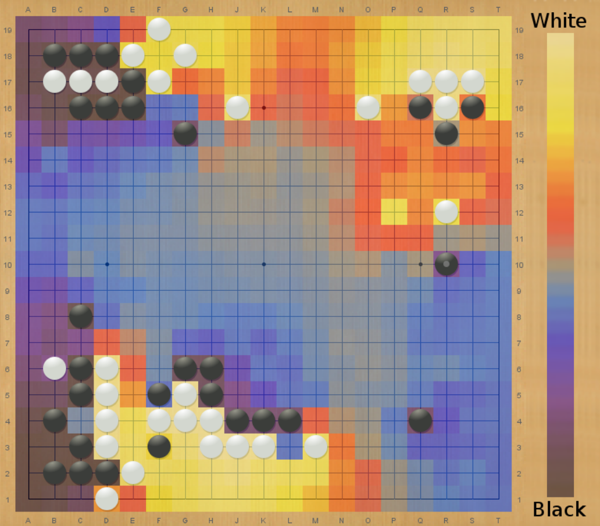
*Visualization of ownership predictions by KataGo[^21]*

As a result of these improvements, KataGo massively outperforms Leela Zero and Facebook's ELF bot in learning efficiency. KataGo achieves a factor of fifty improvement in training efficiency vs ELF:

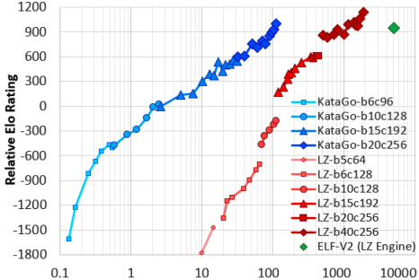
*Relative Elo rating vs self-play cost in billions of equivalent 20 block x 256 channel queries (log scale)*

In addition to these improvements, KataGo also directly optimizes for maximum score (with some caveats), largely eliminating the slack moves found in other Zero style bots. KataGo also plays handicap games against weaker versions of itself during training, plays on multiple board sizes, and with variable komi and rule sets, so it is flexible under permutations of these game settings.

With all of these additional features, KataGo adds up to the most useful analysis tool yet made for Go, providing players with greater insight into the opinions of a superhuman Go agent.

KataGo is likely now the strongest open source Go bot available, recently topping the [CGS rankings](http://www.yss-aya.com/cgos/19x19/bayes.html) in all board sizes.

I highly recommend those interested check out the original [KataGo paper](https://arxiv.org/abs/1902.10565) - it's an extremely accessible read.

## Giving Back
While watching Elo ratings of top bots inexorably climb upwards is fun, the real benefit of strong Go AI lies in what they can give back to humans. Go AI represent one of the first examples of superhuman AI agents already out there in the world, being used by real people to better understand a game they love.

[Igo Hatsuyōron](https://en.wikipedia.org/wiki/Igo_Hatsuy%C5%8Dron) is a collection of Go problems from around 300 years ago, much of it created by the then-strongest player in Japan. The 120th problem in the collection is often considered the most challenging Go problem in the world - it is a whole-board problem that asks the reader to finish the game optimally for both sides and determine the winner and point margin. For hundreds of years Go players have attempted to complete it, but there is still uncertainty about its true solution - the patterns and capturing races that appear in what looks to be the right solution are highly unintuitive and complex, and have eluded agreement about their correctness.

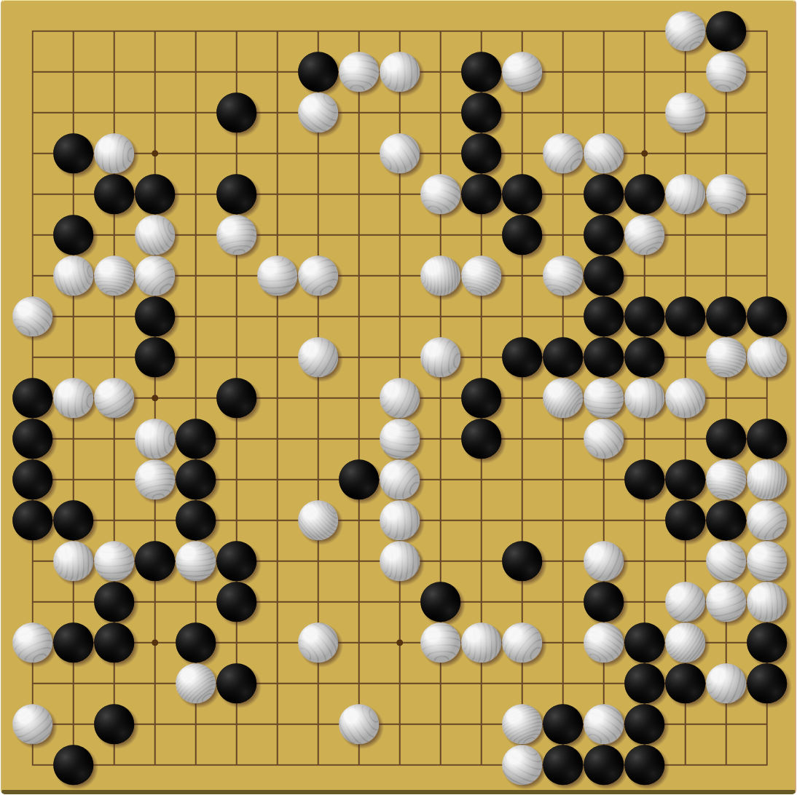
*Igo Hatsuyōron 120 opening position. Black to play. What is the optimal result?*

In late 2019, KataGo was specially trained to solve this problem. The strongest-at-the-time KataGo network was made to play out many games from the problem start position against itself to a terminal state, along the way discovering many of the strange and complex shapes that humans have come to associate with the problem. Now KataGo has been able to suggest new moves along the main-line solution, finding simpler refutations to old human ideas, and finally suggesting a different outcome than what had been believed to be the correct result[^25].

KataGo was able to bring a fresh perspective to this centuries-old problem and give knowledge back to the Go community. How bots like these will continue to bring value and new insight to human problems is an open question, and one that I am excited to see answered in the coming years. We are entering an era where computers can contribute novel insights to the knowledge-base of human endeavors.

## Future
In a [recent interview](https://www.youtube.com/watch?v=uPUEq8d73JI), the lead researcher of AlphaGo, David Silver, said that he expects AlphaZero style bots to continue improving for the next 100 years, that the skill ceiling of Go is still out of sight. KataGo provides a picture of how improvements will continue to be made, and how value for human players can be added along the way. 

For a bit more insight on where things might be heading for the future of Go, I turned to KataGo's author lightvector for some perspective.

**Perhaps even more than playing strength gains, watching how KataGo has improved its utility as an analysis tool through e.g. score estimation and territory ownership prediction has been exciting. Is the future of KataGo more focused on adding additional layers of interpretability and analysis utility to players, or are strength and training efficiency improvements your primary focus?**

> I'm interested in both! But training efficiency and strength are foremost because a lot of the kinds of nice experiments you'd want to do to add interpretability and analysis utility *depend* on things that have to be fundamentally trained into the model. For example, if you want to predict score? The only way is if the neural net was trained to predict score, and there are many approaches to trying that. Maybe you want the bot to be able to tell you the status of a group? You'll need to find some way of training that too. Maybe you want the bot to report some measure of "uncertainty" versus "confidence" about its own evaluation? There are ways you can try to add that on after the fact, but again you might get better results if it was built in to the training from the start.   It greatly expands your ability to run lots of experiments for such things (like KataGo did with score estimation, Japanese rules, and handicap game-training) if training is efficient - the faster you can train to a strong level in each new experiment, the more interesting experiments you can do. But of course, trying to be the strongest and getting closer and closer to optimal play is fun too.  The rate of experimentation may slow in the future since some of KataGo's initial support and arrangements for compute power are wrapping up now, but I hope more research in the future will continue to be possible. I hope that KataGo isn't the last word! There are very likely many more improvements possible, so I'd be happy if in coming years other projects found ways to take KataGo's ideas and efficiency improvements to find yet more improvements, and reach even further. KataGo is open source precisely because sharing of techniques and research, rather than keeping them secret, is what improves the state of the art for everyone.

**Top professional players used to say that even God couldn't give them 4 stones. As KataGo approaches that threshold, do you think Zero-style training will continue to scale indefinitely? Both in terms of strength, but also in how current blind spots are found and dealt with: We've seen, for example, that KataGo doesn't understand (Mi Yuting's) flying dagger joseki as well as Leela Zero, and that it remains blind to certain "sharp" positions. Do you think self-play will be enough to overcome these issues long-term, or will other solutions need to be found? Potentially incorporating other external Go agents in the training game generation process?**

> I think the AlphaZero-style training loop using MCTS is not the last word on things like this. Blind spots are just the most visible of the flaws, but there are some technical and theoretical details you can dig into that start to make it clear that there are some practical problems with how exploration and move discovery work in this loop, some basic theoretical flaws involving mismatches between the neural net's training distribution and usage, and also some fundamental "missing" capabilities in current bots in terms of using search effectively.   Incorporating external data is maybe a possible patch for only one of these issues, and is only a patch - it would be much cooler to find ways to fix them at a more fundamental level rather than patching them after the fact.

**Your paper focused both on self-play improvements designed to find a more optimal balance between exploration and exploitation in training, and neural architecture design choices like adding specific layers and additional training targets. Between raw compute, neural architecture, and the search algorithm used, which aspect do you think has the greatest potential to improve AI performance in Go, and in other settings?**

> Rather than focusing on broad areas from top down and guessing what will have "more potential" it feels more practical to me to focus on specific problems or flaws or ideas - and work up from there. A lot of the current techniques were developed simply by observing specific deficiencies in "vanilla AlphaZero self-play training" and then experimenting with potential solutions, regardless of whether they involved the neural net or the search or something else. For practical ways to make progress, you mostly want to be focused on problems and *then* play with what (possibly entirely new!) methods might solve them, rather than the other way around.   In other words - when you are trying to solve problems, I find you often want to tackle each problem by figuring out the right tool for the job, rather than start with the tool you want to use and then search for the problem to solve with it. Although doing the latter and brainstorming if a tool can be applied more broadly to other things is definitely something you want to do sometimes!

**Are there plans to set up a community contributed computing pool for training KataGo when the current run ends?**

> There are some attempts and plans, and I hope they can get off the ground. Even if they don't, KataGo has reached a great point already and I hope it's made a big impact going forward on any future successors or other projects inspired by it. But yes, I hope a distributed run will be started before too long.

**Are there plans to have KataGo compete in any of the international Go AI competitions?** 

> There aren't any immediate plans - although it could be interesting to compete just for fun. Obviously anything that involves traveling rather than being purely online is a bit of an issue right now with covid-19. Although there's no reason a purely online competition couldn't be organized, many past competitions involved traveling and I'm not aware of any major online-only tournaments that have been organized this year. If there are any I'd be interested to hear of them.  As an aside, it always seemed amusing to me that emphasis is placed on competitions where a bot only plays a grand total of, say, 5 or 10 or 20 games against other opponents, when anyone can download KataGo or Leela Zero or whatever and run hundreds if not thousands of games and gather far more data to compare the bots, and even to find patterns in their individual styles, strengths and weaknesses, and so on. Complicating the matter is that (at least, by my limited recollection) past competitions often allowed things like unbounded hardware - anything that the individual or team or company could afford, which makes it hard to judge the results. Still, I guess they're good entertainment and a good central coordination point for commentary and spectating.

Though bots have overtaken humans in skill, they haven't left us behind: Now they are giving back, contributing to greater understanding and enjoyment of Go. Thanks to projects like KataGo, we are gifted with glimpses of secrets still hidden in this millennia old game. Even if we don't yet understand the true meaning of Go, or of intelligence, chasing after them continues to delight.

[^kata1]: [KataGo vs. Leela Zero](http://www.yss-aya.com/cgos/viewer.cgi?19x19/SGF/2020/05/14/693137.sgf): B+Resign

[^quote1]: [I J Good: The Mystery of Go, 1965](http://www.chilton-computing.org.uk/acl/literature/reports/p019.htm)

[^1]: [xkcd 832](https://xkcd.com/832/)

[^2]: [Tromp: Number of legal Go positions](https://tromp.github.io/go/legal.html)

[^3]: Lower bound: [Walraet and Tromp: A Googolplex of Go Games](https://matthieuw.github.io/go-games-number/AGoogolplexOfGoGames.pdf) 

[^4]: Upper bound: [Tromp and Farneback: Combinatorics of Go](https://tromp.github.io/go/gostate.pdf)

[^6]: [Deep Blue vs. Kasparov](https://en.wikipedia.org/wiki/Deep_Blue_versus_Garry_Kasparov)

[^7]: >AI is the science of making machines capable of performing tasks that would require intelligence if done by humans Minsky, 1968

[^8]: [Legg and Hutter: A Collection of Definitions of Intelligence](https://arxiv.org/abs/0706.3639)

[^9]: Jose Hernandez-Orallo: Evaluation in artificial intelligence: from task-oriented to ability-oriented measurement. Artificial Intelligence Review, pages 397–447, 2017

[^10]: [Chollet: On the Measure of Intelligence](https://arxiv.org/pdf/1911.01547.pdf)

[^11]: [Campbell et al: Deep Blue](https://core.ac.uk/download/pdf/82416379.pdf)

[^12]: [Wikimedia Commons: AB Pruning - Jez9999 / CC BY-SA](https://en.wikipedia.org/wiki/Alpha%E2%80%93beta_pruning)

[^13]: [Coulom: Efficient Selectivity and Backup Operators in Monte-Carlo Tree Search](https://www.remi-coulom.fr/CG2006/CG2006.pdf)

[^14]: [Dumoulin and Visin: Convolution arithmetic](https://github.com/vdumoulin/conv_arithmetic)

[^15]: [Krizhevsky et al.: ImageNet Classification with Deep ConvolutionalNeural Networks](https://papers.nips.cc/paper/4824-imagenet-classification-with-deep-convolutional-neural-networks.pdf)

[^16]: [Universal Approximation Theorem](https://en.wikipedia.org/wiki/Universal_approximation_theorem)

[^17]: [Silver et al: Mastering the game of Go with deep neural networks and tree search](https://www.nature.com/articles/nature16961)

[^18]: [Silver et al: Mastering the game of Go without human knowledge](https://www.nature.com/articles/nature24270.epdf?author_access_token=VJXbVjaSHxFoctQQ4p2k4tRgN0jAjWel9jnR3ZoTv0PVW4gB86EEpGqTRDtpIz-2rmo8-KG06gqVobU5NSCFeHILHcVFUeMsbvwS-lxjqQGg98faovwjxeTUgZAUMnRQ)

[^19]: [He et al: Deep Residual Learning for Image Recognition](https://arxiv.org/abs/1512.03385)

[^20]: [Leela Zero](https://zero.sjeng.org/home)

[^21]: [Wu: Accelerating Self-Play Learning in Go](https://arxiv.org/abs/1902.10565)

[^22]: [Yann Lecun Twitter](https://twitter.com/ylecun/status/1123235709802905600?lang=en)

[^23]: [Godard et al: Digging Into Self-Supervised Monocular Depth Estimation](https://arxiv.org/abs/1806.01260)

[^24]: [Guizilini et al: 3D Packing for Self-Supervised Monocular Depth Estimation](https://github.com/tri-ml/packnet-sfm)

[^25]: [Wu: Deep-Learning the Hardest Go Problem in the World](https://blog.janestreet.com/deep-learning-the-hardest-go-problem-in-the-world/)

